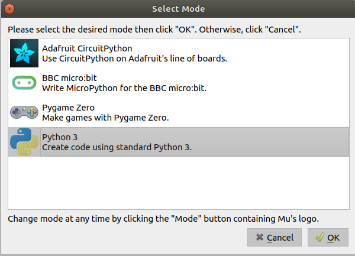
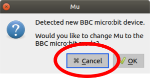
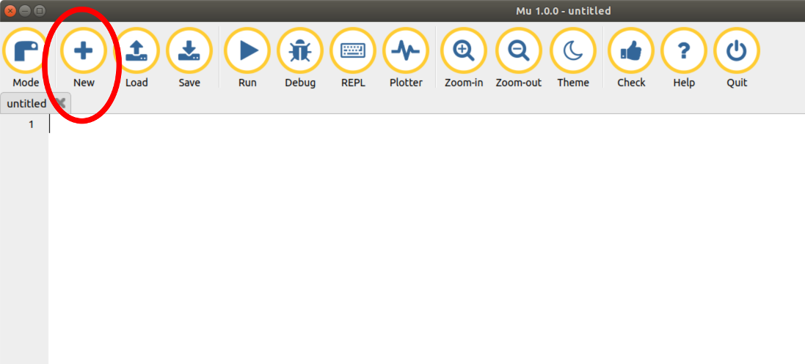
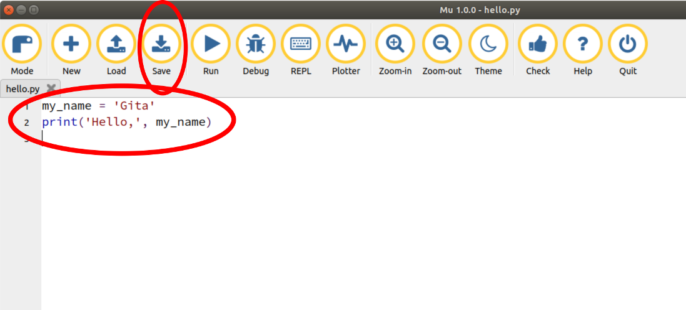
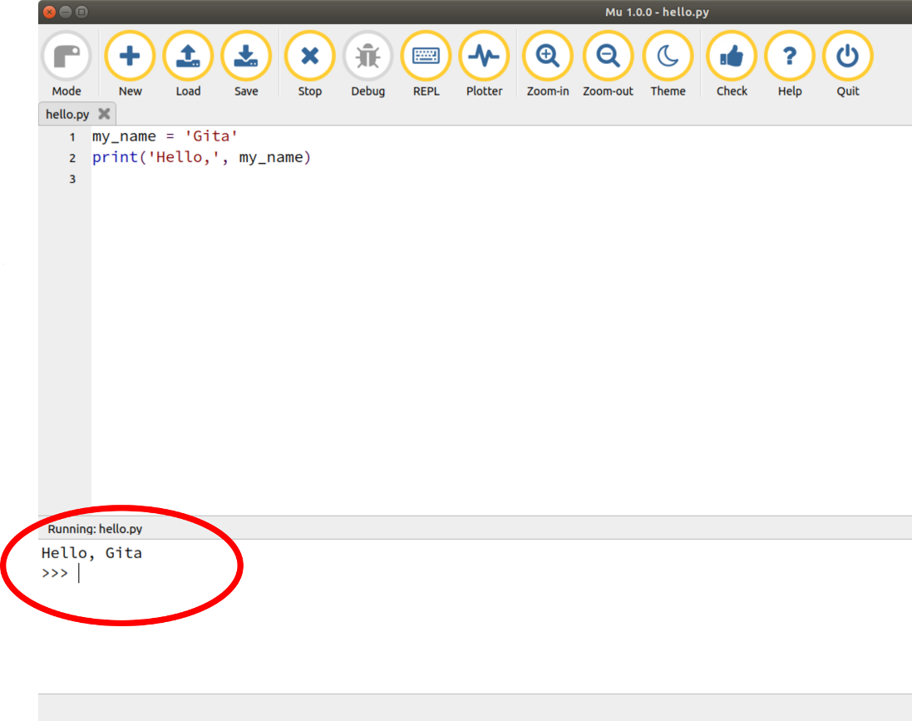

# How to install the Mu Editor

Mu is a simple editor for writing and running Python programs. Follow these [TBC] easy steps to install Mu on your computer and write your first program.


## 1. Install Mu

[TBC]


## 2. Run Mu

[TBC]

Find the Mu icon on your laptop.  Click it to open Mu.


If you see this message, click `Python 3` and then click `OK`.




If you see this message, click `Cancel`.




## 3. Write some Python

Then click the `New` button to give you an empty file to start writing your own program.




Now type in these two lines of code - use your own name instead of "Gita" (unless your name **is** Gita, of course).

````
my_name = 'Gita'
print('Hello,', my_name)
````

Then click the `Save` button and give your program file a name - we called ours `hello`.

Can you guess what the program will do when you run it?




## 4. Run your program

Click the `Run` button and look at the new window that opens at the bottom of Mu.  This is where the Python `print` command sends its output. Did you guess right about what the program would do? 




## Well done!

You have installed Mu on your computer and  tested it. You are all set to learn more about Python at the CoderDojo.


